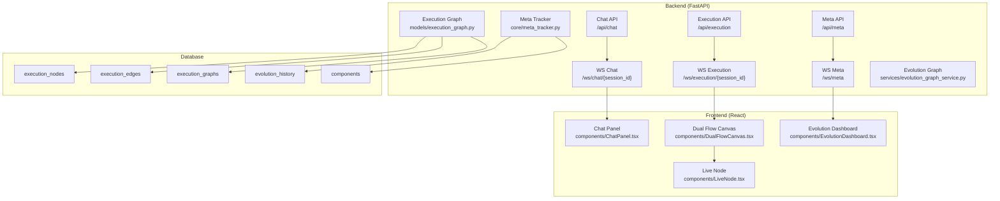

# План реализации визуализации самоэволюционирующей системы

## Архитектура решения



## Этап 1: Модели данных и миграции БД (Фундамент)

### Задачи

1. **Создать модели данных для графа исполнения**

   - `backend/app/models/execution_graph.py` - модели ExecutionNode, ExecutionEdge, ExecutionGraph
   - Связь с ChatMessage через node_id
   - Связь с WorkflowEvent для интеграции

2. **Создать миграцию БД**

   - `backend/alembic/versions/004_execution_graph_tables.py`
   - Таблицы: execution_graphs, execution_nodes, execution_edges
   - Индексы для производительности
   - Foreign keys к существующим таблицам

3. **Документация**

   - `docs/implementation/execution_graph_models.md` - описание моделей и связей
   - Обновить `docs/api/endpoints/workflow.md` с новыми моделями

### Файлы для изменения

- `backend/app/models/execution_graph.py` (новый)
- `backend/app/models/__init__.py` (добавить импорт)
- `backend/alembic/versions/004_execution_graph_tables.py` (новый)
- `docs/implementation/execution_graph_models.md` (новый)
- `docs/api/endpoints/workflow.md` (обновить)

### Критерии завершения

- Модели созданы и протестированы
- Миграция применена успешно
- Документация написана
- Модели интегрированы в существующую систему

### Коммит после завершения

```
feat: Add execution graph models and database migration

- Add ExecutionNode, ExecutionEdge, ExecutionGraph models
- Create database migration 004_execution_graph_tables
- Add documentation for execution graph models
- Integrate with existing ChatMessage and WorkflowEvent models
```

---

## Этап 2: Meta Tracker - базовая версия

### Задачи

1. **Создать Meta Tracker сервис**

   - `backend/app/core/meta_tracker.py` - централизованный трекер изменений
   - Отслеживание создания/изменения агентов и инструментов
   - Версионирование компонентов через ArtifactVersionService
   - Интеграция с AgentEvolutionService

2. **Создать модели для мета-данных**

   - Расширить `backend/app/models/evolution.py` если нужно
   - Использовать существующий `EvolutionHistory` и `Artifact`

3. **Документация**

   - `docs/implementation/meta_tracker.md` - описание архитектуры мета-трекера
   - `docs/api/endpoints/meta.md` (новый) - API спецификация

### Файлы для изменения

- `backend/app/core/meta_tracker.py` (новый)
- `backend/app/models/evolution.py` (возможно расширение)
- `docs/implementation/meta_tracker.md` (новый)
- `docs/api/endpoints/meta.md` (новый)

### Критерии завершения

- Meta Tracker отслеживает создание агентов/инструментов
- Версионирование работает корректно
- Интеграция с существующими сервисами
- Документация написана

### Коммит после завершения

```
feat: Add meta tracker for system evolution tracking

- Implement MetaTracker service for component change tracking
- Integrate with AgentEvolutionService and ArtifactVersionService
- Add documentation for meta tracking architecture
- Track agent and tool creation/modification events
```

---

## Этап 3: Execution Graph Service

### Задачи

1. **Создать сервис для работы с графом исполнения**

   - `backend/app/services/execution_graph_service.py`
   - Методы: create_graph, add_node, add_edge, update_node_status
   - Интеграция с WorkflowEventService

2. **Интеграция с Chat API**

   - Модифицировать `backend/app/api/routes/chat.py`
   - При отправке сообщения создавать ноды графа
   - Связывать сообщения с нодами через node_id

3. **Документация**

   - Обновить `docs/api/endpoints/chat.md` с информацией о графе
   - `docs/implementation/execution_graph_service.md` (новый)

### Файлы для изменения

- `backend/app/services/execution_graph_service.py` (новый)
- `backend/app/api/routes/chat.py` (модификация)
- `docs/api/endpoints/chat.md` (обновить)
- `docs/implementation/execution_graph_service.md` (новый)

### Критерии завершения

- Граф создается при отправке сообщения в чат
- Ноды добавляются при выполнении агентов/инструментов
- Статусы нод обновляются в реальном времени
- Документация обновлена

### Коммит после завершения

```
feat: Add execution graph service and chat integration

- Implement ExecutionGraphService for graph management
- Integrate graph creation with chat message flow
- Link chat messages to execution nodes
- Add documentation for execution graph service
```

---

## Этап 4: REST API для Execution и Meta

### Задачи

1. **Создать Execution API**

   - `backend/app/api/routes/execution.py` (новый)
   - Endpoints: GET /api/execution/{session_id}/graph, GET /api/execution/{session_id}/node/{node_id}
   - POST /api/execution/{session_id}/replay/{node_id}

2. **Создать Meta API**

   - `backend/app/api/routes/meta.py` (новый)
   - Endpoints: GET /api/meta/components, GET /api/meta/evolution-timeline
   - GET /api/meta/components/{id}/diff/{v1}/{v2}
   - POST /api/meta/components/{id}/rollback/{version}

3. **Документация**

   - `docs/api/endpoints/execution.md` (новый)
   - Обновить `docs/api/endpoints/meta.md`

### Файлы для изменения

- `backend/app/api/routes/execution.py` (новый)
- `backend/app/api/routes/meta.py` (новый)
- `backend/app/api/routes/__init__.py` (добавить роутеры)
- `backend/main.py` (подключить роутеры)
- `docs/api/endpoints/execution.md` (новый)
- `docs/api/endpoints/meta.md` (обновить)

### Критерии завершения

- Все API endpoints работают
- Тесты написаны (опционально)
- Документация полная
- API интегрировано в main.py

### Коммит после завершения

```
feat: Add execution and meta API endpoints

- Implement execution graph API endpoints
- Implement meta tracking API endpoints
- Add API documentation
- Integrate APIs into main application
```

---

## Этап 5: WebSocket каналы для реалтайм событий

### Задачи

1. **Расширить WebSocket менеджер**

   - Модифицировать `backend/app/api/routes/websocket_events.py`
   - Добавить каналы: chat, execution, meta
   - Интеграция с существующим ConnectionManager

2. **Создать WebSocket endpoints**

   - `/ws/chat/{session_id}` - потоковая генерация + статусы
   - `/ws/execution/{session_id}` - события графа исполнения
   - `/ws/meta` - мета-события системы

3. **Интеграция с сервисами**

   - Подключить ExecutionGraphService к WebSocket
   - Подключить MetaTracker к WebSocket

4. **Документация**

   - `docs/implementation/websocket_events.md` (новый или обновить)
   - Обновить `docs/api/endpoints/workflow.md`

### Файлы для изменения

- `backend/app/api/routes/websocket_events.py` (расширение)
- `backend/app/services/execution_graph_service.py` (добавить WebSocket broadcast)
- `backend/app/core/meta_tracker.py` (добавить WebSocket broadcast)
- `docs/implementation/websocket_events.md` (новый/обновить)
- `docs/api/endpoints/workflow.md` (обновить)

### Критерии завершения

- WebSocket каналы работают
- События отправляются в реальном времени
- Интеграция с сервисами завершена
- Документация обновлена

### Коммит после завершения

```
feat: Add WebSocket channels for real-time visualization

- Extend WebSocket manager with chat, execution, meta channels
- Integrate ExecutionGraphService with WebSocket
- Integrate MetaTracker with WebSocket
- Add WebSocket event documentation
```

---

## Этап 6: Evolution Graph Service

### Задачи

1. **Создать сервис для графа эволюции**

   - `backend/app/services/evolution_graph_service.py` (новый)
   - Построение графа эволюции из EvolutionHistory
   - Связь версий компонентов

2. **Интеграция с Meta Tracker**

   - Использовать данные из MetaTracker
   - Построение дерева версий

3. **Документация**

   - `docs/implementation/evolution_graph_service.md` (новый)

### Файлы для изменения

- `backend/app/services/evolution_graph_service.py` (новый)
- `docs/implementation/evolution_graph_service.md` (новый)

### Критерии завершения

- Граф эволюции строится корректно
- Версии компонентов связаны правильно
- Документация написана

### Коммит после завершения

```
feat: Add evolution graph service

- Implement EvolutionGraphService for building evolution trees
- Integrate with MetaTracker and EvolutionHistory
- Add evolution graph documentation
```

---

## Этап 7: Фронтенд - Dual Flow Canvas (базовая версия)

### Задачи

1. **Создать Dual Flow Canvas компонент**

   - `frontend/templates/components/DualFlowCanvas.html` или React компонент
   - Граф исполнения (слева) - используя существующую библиотеку графов
   - Граф эволюции (справа) - дерево версий
   - Связь между графами при клике

2. **Интеграция с WebSocket**

   - Подключение к `/ws/execution/{session_id}`
   - Подключение к `/ws/meta`
   - Обновление графов в реальном времени

3. **Документация**

   - `docs/implementation/dual_flow_canvas.md` (новый)
   - Обновить `.cursor/UI_ARCHITECTURE.md`

### Файлы для изменения

- `frontend/templates/components/DualFlowCanvas.html` или React (новый)
- `frontend/static/js/dual-flow.js` (если HTML) или TypeScript компонент
- `docs/implementation/dual_flow_canvas.md` (новый)
- `.cursor/UI_ARCHITECTURE.md` (обновить)

### Критерии завершения

- Граф исполнения отображается
- Граф эволюции отображается
- Связь между графами работает
- WebSocket обновления работают
- Документация написана

### Коммит после завершения

```
feat: Add dual flow canvas component for visualization

- Implement execution graph visualization (left panel)
- Implement evolution graph visualization (right panel)
- Add cross-graph interaction on node click
- Integrate WebSocket for real-time updates
- Add dual flow canvas documentation
```

---

## Этап 8: Live Node компонент

### Задачи

1. **Создать Live Node компонент**

   - `frontend/templates/components/LiveNode.html` или React компонент
   - Отображение статусов нод в реальном времени
   - Метрики (CPU, память, latency)
   - Контекстное меню для управления версиями

2. **Интеграция с Dual Flow Canvas**

   - Использовать LiveNode в графе исполнения
   - Отображение версий компонентов

3. **Документация**

   - `docs/implementation/live_node.md` (новый)

### Файлы для изменения

- `frontend/templates/components/LiveNode.html` или React (новый)
- `frontend/static/js/live-node.js` (если HTML) или TypeScript
- `docs/implementation/live_node.md` (новый)

### Критерии завершения

- Ноды отображают статусы в реальном времени
- Метрики обновляются
- Контекстное меню работает
- Документация написана

### Коммит после завершения

```
feat: Add live node component with real-time metrics

- Implement LiveNode component with status indicators
- Add real-time metrics display (CPU, memory, latency)
- Add context menu for version management
- Integrate with DualFlowCanvas
- Add live node documentation
```

---

## Этап 9: Evolution Dashboard

### Задачи

1. **Создать Evolution Dashboard**

   - `frontend/templates/components/EvolutionDashboard.html` или React
   - Метрики системы (автономность, скорость эволюции, качество)
   - Графики эволюции (timeline, quality trend)
   - Список недавних изменений

2. **Интеграция с API**

   - Подключение к `/api/meta/evolution-timeline`
   - Подключение к `/api/system/metrics` (если есть)

3. **Документация**

   - `docs/implementation/evolution_dashboard.md` (новый)

### Файлы для изменения

- `frontend/templates/components/EvolutionDashboard.html` или React (новый)
- `frontend/static/js/evolution-dashboard.js` (если HTML) или TypeScript
- `docs/implementation/evolution_dashboard.md` (новый)

### Критерии завершения

- Метрики отображаются корректно
- Графики работают
- Список изменений обновляется
- Документация написана

### Коммит после завершения

```
feat: Add evolution dashboard component

- Implement system metrics display
- Add evolution timeline charts
- Add recent changes list
- Integrate with meta API
- Add evolution dashboard documentation
```

---

## Этап 10: Интеграция и финализация

### Задачи

1. **Интеграция всех компонентов**

   - Объединить Chat Panel, Dual Flow Canvas, Evolution Dashboard
   - Обновить главную страницу с новыми компонентами

2. **Тестирование**

   - Проверка всех API endpoints
   - Проверка WebSocket соединений
   - Проверка визуализации

3. **Документация**

   - Обновить `docs/README.md` с информацией о визуализации
   - Создать `docs/guides/visualization_guide.md` (новый)
   - Обновить `.cursor/plans/ToDo_1.md` с информацией о завершении

### Файлы для изменения

- `frontend/templates/main.html` или главный React компонент (обновить)
- `docs/README.md` (обновить)
- `docs/guides/visualization_guide.md` (новый)
- `.cursor/plans/ToDo_1.md` (обновить)

### Критерии завершения

- Все компоненты интегрированы
- Система работает полностью
- Документация полная
- План обновлен

### Коммит после завершения

```
feat: Complete visualization system integration

- Integrate all visualization components
- Update main UI with new components
- Add comprehensive visualization guide
- Update project documentation
- Complete visualization system implementation
```

---

## Связь с ToDo_1.md

Рефакторинг параметров из ToDo_1.md должен интегрироваться с мета-трекером:

1. **Отслеживание изменений параметров**

   - Изменения параметров записываются в EvolutionHistory
   - Meta Tracker отслеживает изменения SystemParameter

2. **Визуализация параметров**

   - Evolution Dashboard показывает историю изменений параметров
   - Связь изменений параметров с изменениями метрик

3. **Документация**

   - Обновить ToDo_1.md с информацией об интеграции
   - Добавить раздел о визуализации параметров

## Общие принципы

1. **Документация в каждом этапе**

   - Техническая документация в `docs/implementation/`
   - API документация в `docs/api/endpoints/`
   - Руководства в `docs/guides/`

2. **Коммиты после каждого этапа**

   - Коммит только после полного завершения этапа
   - Сообщения коммитов в формате Conventional Commits
   - Один коммит на этап (если этап большой, можно разбить)

3. **Тестирование**

   - После каждого этапа проверять работоспособность
   - Интеграционные тесты для критических компонентов

4. **Обратная совместимость**

   - Не ломать существующий функционал
   - Постепенная интеграция с существующими системами