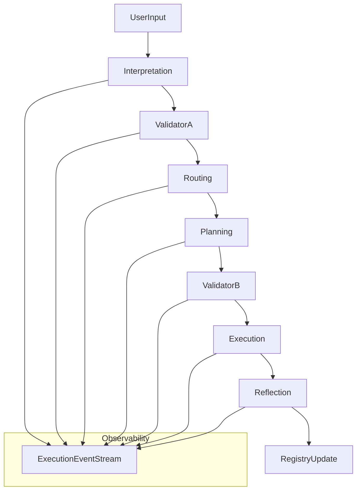

# Plan: Align backend with `contracts_v0` + complete entity documentation

You selected:

- **Normative**: code must be brought into compliance with `docs/api/contracts_v0.md` and `docs/context/*`.
- **Event entity**: treat **`WorkflowEvent` as the concrete `ExecutionEvent`** and update schema + emitters accordingly.

---

## Phase -1 — Execution discipline (hard constraints)

Cursor must NOT:

- refactor business logic
- rename entities unless explicitly requested
- introduce new abstractions beyond what is required to satisfy contracts/shape/readiness

Cursor must:

- work on exactly **one phase at a time**
- stop and report immediately after phase completion (before starting the next phase)

## Scope

- **In-scope inventory**: `backend/app/**` modules/components/services (exclude `backend/scripts/**`, `backend/alembic/**`, `backend/sql/**`, `backend/tests/**`, root helper scripts).
- **In-scope changes**: code + docs needed to make runtime emit and expose events/prompts/contracts per `ARCHITECTURE_LAW.md` and `SERVICE_ORCHESTRATION_READINESS_CHECKLIST.md`.

## Target artifacts

- Updated **event model + emitters** compliant with `ExecutionEvent (v0)`.
- Updated **prompt assignment + runtime prompt resolution enforcement** compliant with `PromptAssignment (v0)`.
- Full **entity catalog** (services/modules/components/capabilities/agents/sandbox/registry) with human + code descriptions.
- A single **interaction document** describing flows and dependencies.

---

## Phase 0 — Define taxonomy + inventory (no scripts/migrations/tests)

**Goal**: enumerate all `backend/app` entities and classify them per ARCHITECTURE_LAW.

- Build an inventory of Python modules under `backend/app/` and classify each file as exactly one of:
- **Service** (domain logic)
- **Module** (internal grouping)
- **Component** (LLM “thinking”)
- **Capability/Tool** (execution)
- **Agent**
- **Sandbox**
- **Registry**
- **Legacy/Unknown** (explicitly marked; allowed but not silent)

### Phase 0 completion criteria

- every `backend/app/**.py` file has **exactly one** classification
- any file without a clear classification is **explicitly marked** as `legacy` or `unknown`
- no refactor; only inventory + classification outputs
- Output:
- `backend/docs/entities/catalog.json`
- `backend/docs/entities/catalog.md`

Key sources:

- `docs/context/ARCHITECTURE_LAW.md`
- `docs/context/SERVICE_ORCHESTRATION_READINESS_CHECKLIST.md`
- `.cursor/plans/AARD — Prompt-Centric Architecture & Execution Plan_v0.1.md`

---

## Phase 1 — Make `WorkflowEvent` satisfy `ExecutionEvent (v0)`

**Goal**: `WorkflowEvent` + API output conforms to required fields and canonical stage mapping.

### Phase 1 rules

- Migration is an **implementation detail**.
- Phase 1 success criteria is **runtime + API shape**, not DB perfection.

### 1.1 Schema alignment

Update `backend/app/models/workflow_event.py` to include required `ExecutionEvent` fields:

- **Already present**: `id` (event_id), `timestamp`, `workflow_id`, `session_id`, `stage` (needs canonical), `component_role`, `prompt_id`, `prompt_version`, `decision_source`, `status`, `parent_event_id`, `event_metadata`.
- **Missing as first-class fields** (per contracts_v0):
- `component_name` (actual component/agent id)
- `input_summary`
- `output_summary`
- `reason_code`

Implementation decision:

- Add these as explicit columns (likely JSONB for summaries/reason_code).

### 1.2 Canonical stage enforcement

`contracts_v0` requires stages:

- `interpretation`, `validator_a`, `routing`, `planning`, `validator_b`, `execution`, `reflection`

Current `WorkflowStage` enum is different (`USER_REQUEST`, `REQUEST_PARSING`, …).

- Update stage handling to **store canonical stages** in `WorkflowEvent.stage`.
- If internal trackers still use non-canonical stages, introduce a **single mapping function** (e.g. in `app/core/workflow_tracker.py`) and enforce that persistence uses canonical.

### 1.3 Emission path

Update `backend/app/services/workflow_event_service.py` and upstream callers (e.g. `app/core/request_orchestrator.py`, `app/services/execution_service.py`, `app/services/decision_router.py`, etc.) so that every emitted event includes:

- `stage`
- `component_role`
- `component_name`
- `decision_source`
- `input_summary` / `output_summary`
- `reason_code`
- `prompt_id`/`prompt_version` when LLM used

### 1.4 API contract

Ensure `backend/app/api/routes/workflow_events.py` returns the required shape (either directly or via `to_dict()`), matching field names in `docs/api/contracts_v0.md`.

### 1.5 Tests

Add contract tests (no business logic refactor):

- a unit test that builds a `WorkflowEvent` and asserts required keys exist in API serialization.
- a stage validation test ensuring only canonical stages are stored.

Files likely touched:

- `backend/app/models/workflow_event.py`
- `backend/app/services/workflow_event_service.py`
- `backend/app/api/routes/workflow_events.py`
- `backend/app/core/workflow_tracker.py` and/or `backend/app/core/workflow_engine.py`
- Alembic migration in `backend/alembic/versions/` (implementation artifact; not part of “inventory”)

---

## Phase 2 — Verify and enforce `PromptAssignment (v0)` + prompt-centric rules

**Goal**: every LLM call is associated with `component_role`, resolved via PromptAssignment order, and emitted in events.

### 2.1 PromptAssignment model verification

Confirm `backend/app/models/prompt_assignment.py` fields match contracts_v0 (they largely do) and tighten:

- validate `scope` values
- validate `stage` matches canonical mapping for `component_role`

### 2.2 Runtime enforcement

Ensure every LLM invocation path goes through prompt resolution:

- Use `backend/app/services/prompt_runtime_selector.py` (already implements resolution order).
- Add a guard/helper in the LLM call layer (likely `app/core/ollama_client.py` and/or service wrapper) that refuses to call LLM without a resolved `prompt_text` and logs an `ExecutionEvent` with `decision_source` and prompt metadata.

### 2.3 Tests

- Add a test that any “LLM call entrypoint” requires `component_role` and yields `prompt_id/prompt_version`.

### 2.x Explicit exemptions (documented, not silent)

Allowed exceptions:

- test mocks
- bootstrap/setup paths
- legacy flows explicitly marked as such

Rule:

- Any uncovered LLM call must be **either**:\n  - routed via `prompt_runtime_selector`\n  - or explicitly annotated as `legacy/exempt` (with a reason)

Files likely touched:

- `backend/app/models/prompt_assignment.py`
- `backend/app/services/prompt_runtime_selector.py`
- LLM call entrypoints: `backend/app/core/ollama_client.py`, `backend/app/services/ollama_service.py` (and any other model invocation surface)

---

## Phase 3 — Documentation for every entity (human + code)

**Goal**: every entity is described for humans and has a code-level contract.

### Phase 3 rules

- Minimal contract documentation only (no narrative, no refactor).
- No rewording of existing docs unless required to satisfy readiness checklist.

### 3.1 Service/module/component docs

Create docs under:

- `backend/docs/services/` (services)
- `backend/docs/components/` (LLM components)
- `backend/docs/capabilities/` (tools)
- `backend/docs/agents/` (agents)
- `backend/docs/registry/` (registry)

Each doc must include:

- type (Service/Module/Component/Capability/Agent/Sandbox/Registry)
- role (1–2 sentences)
- Inputs / Outputs / Errors
- LLM usage (yes/no; prompt_id/version if yes)
- Observability: event emission fields (stage/component_role/decision_source)
- Readiness checklist status (PASS/FAIL + VERIFY items)

### Documentation template (strict)

Each entity doc MUST follow this exact structure:

## <EntityName>

Type:Role:Inputs:Outputs:LLM usage:Events emitted:Readiness: PASS / FAIL (with reason)Update or extend:

- `backend/docs/restuct.md` to link to the new per-entity docs.
- `docs/api/contracts_v0.md` only with **clarifying implementation notes**, not weakening requirements.

---

## Phase 4 — Interaction spec: how everything works together

**Goal**: single document that shows component-level flow and service dependencies.Create:

- `backend/docs/architecture/backend_interactions.md` with:
- canonical stage pipeline (interpretation → … → reflection)
- which component/service runs each stage
- where prompts are resolved
- where events are emitted

Include a mermaid diagram similar to:

---