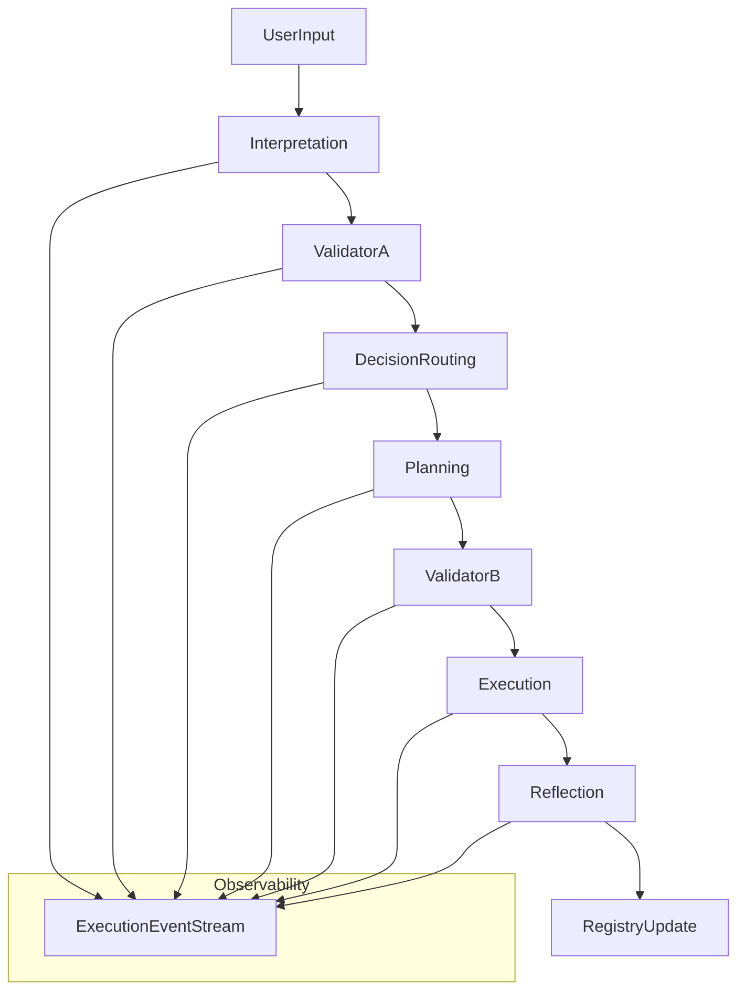

## Backend interaction spec — canonical pipeline and mappings

This document describes the canonical request pipeline, which components/services run each stage, where prompts are resolved, and where ExecutionEvent (WorkflowEvent) is emitted. It follows `docs/api/contracts_v0.md`, `docs/context/ARCHITECTURE_LAW.md` and the project plan.

Canonical pipeline (stage order)

Stage → Component/Service → Primary file(s) (implementation) → Prompt resolution location → Events emitted

- interpretation:
  - Component/Service: InterpretationService (component wrapper)
  - Files: `app/components/interpretation_service.py`, `app/services/interpretation_service.py`
  - Prompt resolution: `ComponentPromptRepository.get_system_prompt` (disk canonical) or `PromptRuntimeSelector` via `PromptManager` when orchestrator provides context
  - Events: emits workflow_event with stage `interpretation`, component_role `interpretation`

- validator_a (semantic validation):
  - Component/Service: SemanticValidator
  - Files: `app/components/semantic_validator.py`
  - Prompt resolution: component system prompt via PromptAssignment → `PromptRuntimeSelector` or disk fallback
  - Events: emits workflow_event with stage `validator_a`, component_role `semantic_validator`

- routing:
  - Component/Service: DecisionRoutingCenter / DecisionRouter
  - Files: `app/components/decision_routing.py`, `app/services/decision_router.py`
  - Prompt resolution: decision component prompt via PromptAssignment (`PromptRuntimeSelector`) or disk-canonical via `ComponentPromptRepository`
  - Events: emits workflow_event with stage `routing`, component_role `routing`

- planning:
  - Component/Service: PlanningService (component + service)
  - Files: `app/components/planning_service.py`, `app/services/planning_service.py`
  - Prompt resolution: `PromptRuntimeSelector` (experiment → agent → global → disk) or `PromptManager` when orchestrator/context is present
  - Events: emits workflow_event with stage `planning`, component_role `planning`

- validator_b (execution validation):
  - Component/Service: ExecutionValidator
  - Files: `app/components/execution_validator.py`
  - Prompt resolution: component prompt via PromptAssignment / disk fallback
  - Events: emits workflow_event with stage `validator_b`, component_role `execution_validator`

- execution:
  - Component/Service: Agents + ExecutionService + Tools
  - Files: `app/services/execution_service.py`, `app/agents/*`, `app/tools/*`, `app/services/code_execution_sandbox.py`
  - Prompt resolution:
    - If agent: agent-level prompt from Registry (`agent.system_prompt`) resolved by AgentFactory/AgentService or `PromptRuntimeSelector` when agent-scoped assignment exists
    - If service-driven LLM call: resolve via `PromptRuntimeSelector` or `PromptManager` before calling low-level client
  - Events: emits workflow_event with stage `execution`, component_role `agent_{name}` or `execution` as appropriate

- reflection:
  - Component/Service: ReflectionService / Reflection-related services
  - Files: `app/components/reflection_service.py`, `app/services/reflection_service.py`
  - Prompt resolution: `PromptRuntimeSelector`/`PromptService` or component repository
  - Events: emits workflow_event with stage `reflection`, component_role `reflection`

- registry update:
  - Component/Service: Service Registry / Agent Factory
  - Files: `app/registry/service.py`, `app/core/service_registry.py`, `app/services/agent_service.py`, `app/services/agent_registry.py`
  - Prompt resolution: N/A (registry is not an LLM component)
  - Events: emits workflow_event for registry changes (stage as appropriate)

Where prompts are resolved (summary)

- Primary resolver: `PromptRuntimeSelector` (implemented in `app/services/prompt_runtime_selector.py`) — resolution order: experiment → agent → global → disk.
- Prompt management and persistence: `PromptService` (`app/services/prompt_service.py`) and `app/models/prompt_assignment.py`.
- Orchestrator-level prompt selection: `PromptManager` / `app/core/prompt_manager.py` (used by `request_orchestrator` to set context.prompt_manager).
- Component disk fallback: `ComponentPromptRepository` (`app/components/prompt_repository.py`) reads canonical prompts from disk.
- Agent prompts: stored on agent record (`agent.system_prompt`) retrieved via `AgentService`/registry.

Where ExecutionEvents are emitted and persisted

- Persistent emitter: `WorkflowEventService.save_event()` (`app/services/workflow_event_service.py`) — preferred method to persist and broadcast events.
- Many components/services call `WorkflowEventService.save_event()` directly (or via orchestrator) to record ExecutionEvent-compliant payloads. The API surface for retrieval is `app/api/routes/workflow_events.py`.

Guidelines for implementers (short)

- All LLM calls MUST be preceded by prompt resolution via `PromptRuntimeSelector` or use an explicit, documented LEGACY_PROMPT_EXEMPT annotation (Phase 2).
- Emit `WorkflowEvent` for major transitions: after interpretation, after each validator decision, after routing decision, when plan produced, before and after execution steps, and after reflection analysis.
- Use canonical stage names in persisted events: `interpretation`, `validator_a`, `routing`, `planning`, `validator_b`, `execution`, `reflection`.
- Do NOT call low-level `OllamaClient.generate()` directly without resolving `system_prompt` at the caller.

References

- `backend/docs/entities/catalog.md`
- `backend/docs/llm_call_inventory.md`
- `backend/app/services/workflow_event_service.py`
- `backend/app/services/prompt_runtime_selector.py`
- `docs/api/contracts_v0.md`

